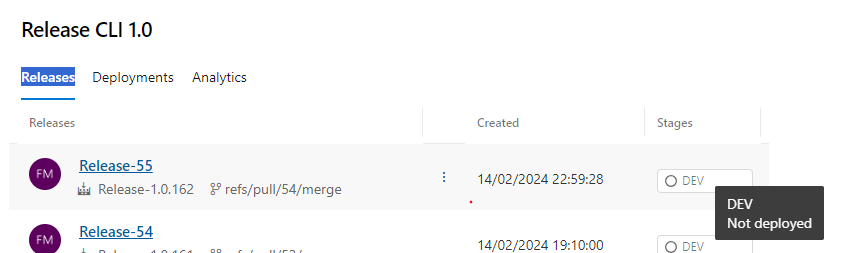

# Processus d'intégration continue (CI) et de déploiement continu (CD) utilisant Azure DevOps

## Configuration de l'Intégration Continue

### Déclenchement des Pipelines

Les pipelines d'intégration continue sont configurés pour se déclencher automatiquement lors d'un pull request vers la branche principale. La validation de l'intégration continue est un prérequis avant toute fusion de code.

### Processus d'Intégration

- Build : Compilation du code source en un exécutable ou en un paquet déployable.
- Tests Automatisés : Exécution de tests pour vérifier la qualité et la fonctionnalité du code.
- Publication des Releases : Création et stockage des artefacts de release dans Azure DevOps.

## Gestion du Déploiement Continu

Bien que l'intégration continue soit automatisée, le déploiement continu nécessite actuellement une intervention manuelle.

### Accès aux Releases

https://dev.azure.com/faikmehmeti/G4-FISA-24/_release?_a=releases&view=mine&definitionId=1

Vous pourriez suivre ici l'état de déploiement pour chaque release

Ce lien permet de suivre l'état de déploiement pour chaque release.

### Gestion du Déploiement

En sélectionnant une release, vous serez dirigé vers une page où le déploiement continu peut être géré. Actuellement, les déploiements doivent être effectués manuellement pour chaque étape (Stages).

